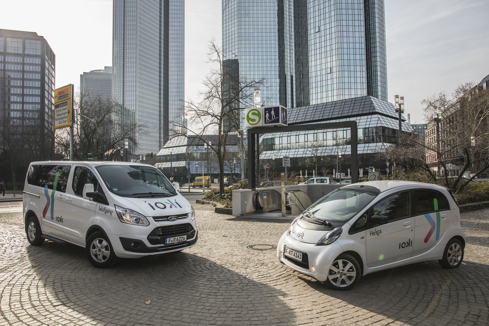
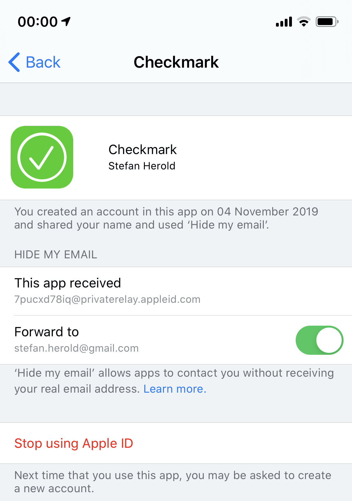
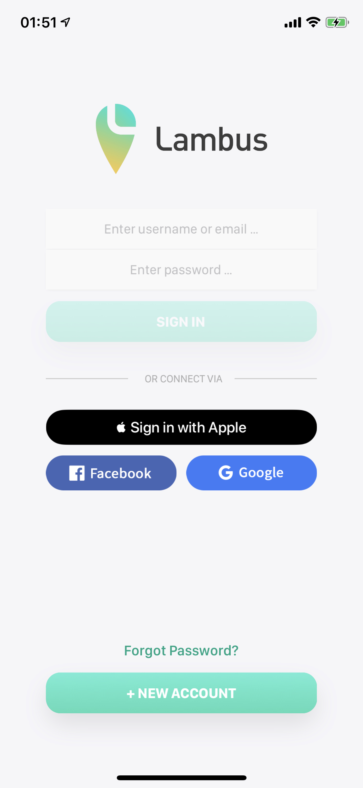
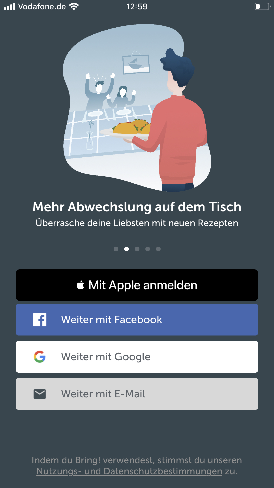
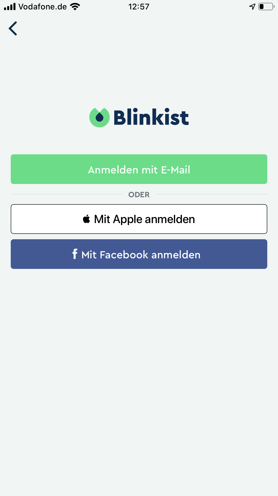
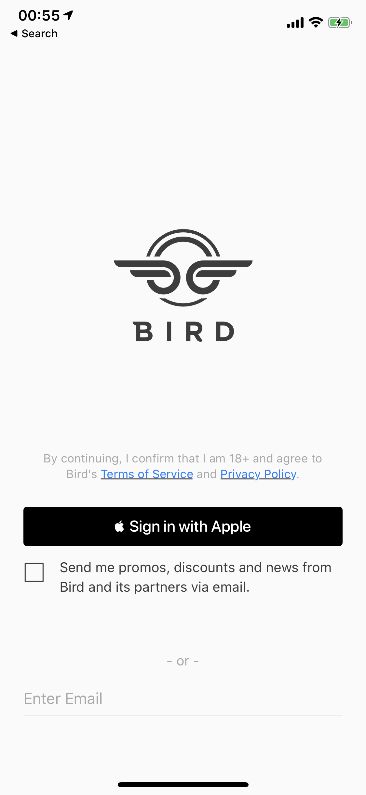
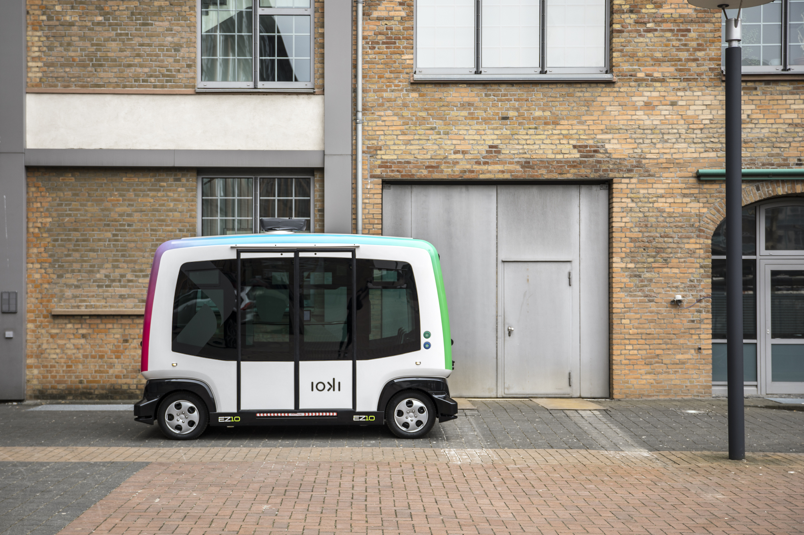
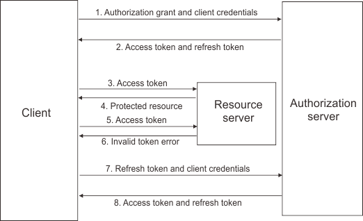

theme: Letters From Sweden, 4
build-lists: false
autoscale: true
footer-style: alignment(center)
slidenumbers: true
slidenumber-style: alignment(left)

<!-- footer: Stefan Herold • ioki • 04.12.2019 -->

[.text: alignment(center)]

<br/>
<br/>


## Sicher, schnell und einfach zum neuen Account

---

# About Me

- Stefan Herold • *@blackjacxxx 🐦*
- Mobile Dev seit 2009
- Seit 2017 bei *ioki* im Herzen Frankfurts

---

# ioki

[.build-lists: true]



- Demand Responsive Transport
- Leuchtturmprojekt mit HVV Hamburg
- Whitelabel Passenger App • iOS & Android
- Driver App • React Native
- Backend • Ruby

^
- Tochtergesellschaft DB
- Kunden: Landkreise, Verkehrsbertriebe, Firmen
  - Autonomes Fahren
  - Consulting durch Analytics Team mit Hilfe von Simulationen -> Bedarfsfelder für Kunden
  - Demand Responsive Transport
    - Transport von Personen von einem Ort zum Anderen
    - Fahrzeuge nach Bedarf verteilen & dynamisch skalieren

---

# Sign in with Apple

[.build-lists: true]

- Registrierung und Login
- schnell, sicher und privat
- kein Tracking durch Apple
- App erhält:
  - stabile, eindeutige *userID*
  - *Vor- und Nachname*
  - verifizierte *Email Adresse*

^
- Facebook & Co leiten weit mehr Informationen weiter

--- 

# Sign in with Apple

| Platform | Apple ID  |
| --- | --- |
| iOS 13+<br />iPadOS 13+<br />tvOS 13+<br />watchOS 6+<br />macOS Catalina 10.15+ | iCloud Nutzer |
| Web<br />Windows<br />Android | beliebige Apple ID |

---

# Sicher

- Kein Passwort
- Zwei-Faktor-Authentisierung 
- Anti-Fraud (Glaubwürdigkeitsprüfung)
  - Jahrelang entwickelter Algorithmus
  - On-Device Machine Learning / Account History
  - 1-Bit-Info über Echtheit des Users
  - iOS only

---

# Privat

[.build-lists: true]



Eindeutige, zufällige Email
*privaterelay.appleid.com*

App sieht nur *diese* Email

- Kommunikation mit *genau einem* Developer
- Zwei-Wege-Kanal
- Kein speichern von Emails
- Weiterleitung deaktivierbar

^
- Facebook & Co leiten original Email weiter
- Rückschlüsse auf Nutzerverhalten erschwert

---

# Wer's braucht

Apps die exklusiv third-party login service nutzen

- *Facebook* Login
- *Google* Sign-In
- Sign in with *Twitter*
- Sign In with *Linked-In*
- Login with *Amazon*
- *WeChat* Login

---

# Wer nicht

[.build-lists: true]

- App nutzt firmeneigenes Login-System
- App nutzt ausweisbasiertes Login-System
- App ist Client für 3rd party / social service
- Bildungs-, Enterprise- oder Business-App mit existierendem Firmen-Account

^
- Email / Password
- Ausweis, Reisepass, E-ID
- Facebook oder Twitter Client
- Mitarbeiterportal von Konzernen

--- 

# Apps

    

---

# Registrierung



| App          | Email  | Name  |
| ------------ | :----: | :---: |
| Bird         | ✅     | ✅   | 
| Lambus       | ✅     | ✅   | 
| Bring        | ✅     | ✅   | 
| Blinkist     | ✅     | ❌   | 
| Parcel       | ❌     | ❌   | 

^
- E-Scooter Verleih
- Travel Planner
- Einkaufslistenapp mit Extras
- Zusammenfassungen beliebter Bücher
- Tracken von Paketsendungen

^
• Name editierbar
• Nutzer entscheidet über Email
• Zufällige Email über Relays
• Keine lästigen Formulare
• Keine Verifizierung
• Keine 2FA

---

# Registrierung

[.build-lists: true]

Folgendes bekommen wir:

- *UserID* • eindeutig, stabil über alle Geräte mit gleicher AppleID
- *Identity Token* • JWT zur Nutzerverifizierung • 10 min
- *Auth Code* • Refresh Token
- *Verifizierte Email* • entfällt beim Onboarding
- *Vor- und Zuname* • PersonNameComponents
- *Real User Indicator* • Boolean: User / Unknown
- *Credential State* • authorized, revoked, notFound

^
- userID unverändert • selbst nach Trennung von App & AppleID (Settings)
- userID: Account Recovery, Account Lockout, Customer Support

---

# Demo 👨‍💻

^
- Capability ➡️ Xcode
\> Xcode erzeugt AppID mit SIWA Cap
- SIWA Button
- Registrierung neuer Nutzer
- Login registrierter Nutzer
- Statuscheck beim Appstart
- Auf Tokeninvalidierung reagieren

^
- Revoke von *appleid.apple.com*

---

# Zusammenfassung

[.build-lists: true]

- Überblick über Vor- / Nachteile
- Was bedeuten Sicher & Privat
- *Theorie:* Registrierung & Login
- *Praxis:* Erweitern einer bestehenden App

---

# Vielen Dank Für's Zuhören 🎉

🧐 Demo App Code & Slides
*https://github.com/Blackjacx/SignInWithApple*
📺 Introducing Sign In with Apple - Session Video Notes
*https://github.com/Blackjacx/WWDC#introducing-sign-in-with-apple*


👩‍💻 Apple Docs
*https://developer.apple.com/sign-in-with-apple*
👨‍⚖️ Review Guidelines
*https://developer.apple.com/app-store/review/guidelines/#sign-in-with-apple*
👨‍💻 REST API
*https://developer.apple.com/documentation/signinwithapplerestapi*


🐦 Twitter
*@blackjacxxx*

---

# Mehr Links

- Answers to your bruning questions
*https://techcrunch.com/2019/06/07/answers-to-your-burning-questions-about-how-sign-in-with-apple-works*
- Token Handling im Backend
*https://blog.curtisherbert.com/so-theyve-signed-in-with-apple-now-what*
- Ray Wenderlich Tutorial mit SwiftUI
*https://www.raywenderlich.com/4875322-sign-in-with-apple-using-swiftui*
- Sign in with Apple für Web
*https://developer.okta.com/blog/2019/06/04/what-the-heck-is-sign-in-with-apple*
- 9To5Mac Artikel
*https://9to5mac.com/2019/10/15/how-to-use-sign-in-with-apple-iphone-ipad-mac*
- How to integrate Sign In with Apple in your iOS app
*https://benoitpasquier.com/how-to-integrate-sign-in-with-apple-ios/*
- Auth0 - Sign In With Apple
*https://auth0.com/docs/quickstart/native/ios-swift-siwa/00-login*
- Why sign-in with apple may take you more than 5 minutes and how it works?
*https://dev.to/michalrogowski/why-sign-in-with-apple-may-take-you-more-than-5-minutes-and-how-it-works-55p6*

- Erzeugen des Private Keys
*https://developer.apple.com/account/resources/authkeys/add*
- Konfiguration erlaubter Email-Adressen
*https://developer.apple.com/account/resources/services/configure*
- Why isn't the user data being returned every time?
*https://forums.developer.apple.com/thread/119826*

---

# Backup

---

# ioki



- Autonomous Driving
- Erster fahrerloser Service Deutschlands
- Bad Birnbach • Bayern
- 2 km • Stadtzentrum - Bahnhof

^
1. Tochtergesellschaft DB
2. 3 Säulen

---

# Registrierung

```swift
func didPressSignInWithApple(_ sender: UIButton) {

  let provider = ASAuthorizationAppleIDProvider()
  let request = provider.createRequest()
  request.requestedScopes = [.email, .fullName] // optional - only request what's required

  let controller = ASAuthorizationController(authorizationRequests: [request])
  controller.delegate = self
  controller.presentationContextProvider = self
  controller.performRequests()
}
```

---

# Login

Beim Appstart:

```swift
let provider = ASAuthorizationAppleIDProvider()

provider.getCredentialState(forUserID: userId) { (state, error) in
  // evaluate state
}
```

State-Änderungen:

```swift
let name = ASAuthorizationAppleIDProvider.credentialRevokedNotification
center.addObserver(forName: name, object: nil, queue: nil) { [weak self] _ in
  self?.performSignOut()
}
```

^
- getCredentialState läuft lokal (mit conditioner 100% loss)

---

# OAuth



---

# Todo

- 1.5h im 1. test mit Fragen zwischendurch
- 1h zu hause / ohne Fragen / ziemlich schnell
- 45 min bei ioki / ohne Fragen / medium schnell

- Zusammenfassung eventuell rausnehmen
- Anfang irgendwie kürzer machen
- use ioki iPhone 7 Plus phone number as trusted number
