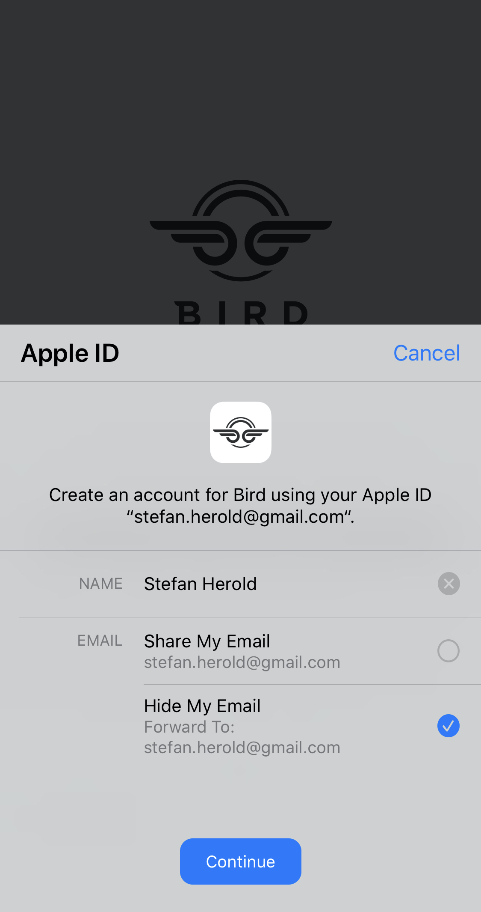

theme: Letters From Sweden, 4
build-lists: true
autoscale: true
footer: Stefan Herold • ioki • 04.12.2019
footer-style: alignment(center)
slidenumbers: true
slidenumber-style: alignment(right)

[.text: alignment(center)]

<br/>
<br/>


## Sicher, schnell und einfach zum neuen Account

---

# Agenda

1. Wer bin ich & Was ist ioki?
2. Sign in With Apple - Überblick & Merkmale
3. Registrierung vs. Login
4. Backend
5. Setup Sign in With Apple & Demo
6. Summary

---

# About Me

- Stefan Herold *@blackjacxxx*
- iOS Entwickler seit 2009
- Konzern, Agentur und Startup
- Seit 2017 bei *ioki* im Herzen Frankfurts

^ 
- DTAG, N&L und flinc 
- haben sich mit ride sharing befasst
- das hat mich zu ioki geführt

---

# ioki


- Autonomous Driving
- Erster fahrerloser Service Deutschlands
- Bad Birnbach • Bayern
- 2 km • Stadtzentrum - Bahnhof

^
1. Tochtergesellschaft DB
2. Drei Säulen

---

# ioki


- Demand Responsive Transport
- Kein Linienverkehr (Fahrplan)
- Routen nach Demand berechnet
- Leuchtturmprojekt mit HVV Hamburg

^
- HVV -> German Mobility Award 2019

---

# ioki


- Whitelabel
- Passenger App (iOS / Android)
- Driver App (React Native > Android Tablets)

---

# Sign In With Apple

- schnell, einfach, sicher und privat
- kein Tracking durch Apple
- Registrierung und Login
- App erhält 
  - stabile, eindeutige *ID*
  - *Vor- und Nachame*
  - verifizierte *Email-Adresse*
- iOS 13+, iPadOS 13+, watchOS 6+, macOS Catalina 10.15+ tvOS 13+, *JavaScript -> Web, Windows, Android*
  - OS: nur mit eingeloggtem iCloud Nutzer
  - Web: beliebige Apple ID

---

# Sicher

- kein Passwort
- On-Device Anti-Fraud
  - On-Device Machine Learning + Account History + Hardware Beschleunigung
  - App erhält 1-Bit Info: User/Unknown
  - only on iOS
- Zwei-Faktor-Authentisierung

---

# Privat


Eindeutige, zufällige Email-Adresse
*<random>@privaterelay.appleid.com*

*Privat:*
-  speichert keine Emails
- App sieht nur *diese* Adresse
- Kommunikation mit *einem* Developer

- Zwei-Wege-Email-Kommunikation
- Über Einstellungen änder-/deaktivierbar
- Verbunden mit verifizierter Apple ID

^
- Relays

---

# Wer's braucht

Apps die exklusiv third-party / social login service nutzen[^1]

- Facebook Login
- Google Sign-In
- Sign in with Twitter
- Sign In with Linked-In
- Login with Amazon
- WeChat Login

[^1]: https://developer.apple.com/app-store/review/guidelines/#sign-in-with-apple

---

# Wer nicht

- App nutzt firmeneigenes Login-System
- App nutzt Ausweisbasiertes Login-System
- App ist Client für 3rd party / social service
- Bildungs-, Enterprise- oder Business-App mit existierendem Firmen-Account

^
- Email / Password
- Ausweis, Reisepass, E-ID
- Facebook oder Twitter Client
- Mitarbeiterportal von Konzernen

---

# Apps



| App          | Email  | Name  |
| ------------ | :----: | :---: |
| Bird         | ✅     | ✅   | 
| Lambus       | ✅     | ✅   | 
| Bring        | ✅     | ✅   | 
| Blinkist     | ✅     | ❌   | 
| Parcel       | ❌     | ❌   | 

^
- E-Scooter Verleih
- Travel Planner
- Einkaufslistenapp mit Kundenkarten Wallet
- Kurze Zusammenfassungen beliebter Sachbücher
- Versandtracking

---

# Registrierung

```swift
func didPressSignInWithApple(_ sender: UIButton) {

  let provider = ASAuthorizationAppleIDProvider()
  let request = provider.createRequest()
  request.requestedScopes = [.email, .fullName] // optional - only request what's required

  let controller = ASAuthorizationController(authorizationRequests: [request])
  controller.delegate = self
  controller.presentationContextProvider = self
  controller.performRequests()
}
```

---

# Registrierung

Authorization Request returns:
- UserID which is unique, stable and team-scoped and can be used as the key to the user / User-ID: eindeutig, stabil über alle Geräte mit gleicher Apple ID
- Verification Data identity token and short-lived code to refresh token
- Full Name as PersonNameComponents which contain first/last name separately
- Verified email your server doesn't need to verify this email again
- Real User Indicator high confidence indicator that likely real user
- Credential State tells if UserID is authorized (let user pass), revoked (handle unlink) or not Found (show login)

---

# Registrierung


- Keine lästigen Formulare
- Keyboard überflüssig
- Name editierbar
- Nutzer entscheidet über verwendete Email
- Fake Email per Relays
- Keine Verifizierung
- Keine 2FA

---

# Login

Beim Appstart:

```swift
let provider = ASAuthorizationAppleIDProvider()

// Very fast API to be called on app launch to handle log-in state appropriately.
provider.getCredentialState(forUserID: userId) { (state, error) in
  // evaluate state
}
```

State-Änderungen:

```swift
let name = ASAuthorizationAppleIDProvider.credentialRevokedNotification
center.addObserver(forName: name, object: nil, queue: nil) { [weak self] _ in
  self?.performSignOut()
}
```

---

# Demo

- Vorbereitung von Xcode
- *Sign in With Apple* Button hinzufügen
- Registrierung neuer Nutzer
- Login registrierter Nutzer
- Statuscheck beim Appstart
- Logout Handling, z.B. von anderem Gerät
- Tokeninvalidierung durch Nutzer über iOS Settings

^
1. SIWA Capability ➡️ Dev Portal
2. SIWA Capability ➡️ Xcode
3. Handle state changes via notification
4. Revoke
- Settings.app ➡️ your Apple ID ➡️ Password & Security ➡️ Apps Using your Apple ID
- If a user revokes Sign in with Apple, but then goes back to register with it in your app, so far in my testing the user value stays the same. This is great news for account recovery / lockout / customer support. Consider this revoke action more of a "log out" than a deletion or something.

---

# Backend

https://blog.curtisherbert.com/so-theyve-signed-in-with-apple-now-what/

---

# Zusammenfassung

---

# Links

👩‍💻 Apple Docs
*https://developer.apple.com/sign-in-with-apple*
👨‍⚖️ Review Guidelines
*https://developer.apple.com/app-store/review/guidelines/#sign-in-with-apple*
👨‍💻 REST API zur Nutzer Verifizierung
*https://developer.apple.com/documentation/signinwithapplerestapi*
🧐 Demo App Code
*https://github.com/Blackjacx/SignInWithApple*
📺 Introducing Sign In with Apple - Session Video Notes
*https://github.com/Blackjacx/WWDC#introducing-sign-in-with-apple*
🔑 Token Handling im Backend
*https://blog.curtisherbert.com/so-theyve-signed-in-with-apple-now-what/*

🐦 Twitter
*@blackjacxxx*

---

# Backup - Todo

- Unterschiede zu Facebook Login herausarbeiten
- create new apple id for live demo
- create backup videos demoing all steps from Summary
- backend teil schreiben
- Zusammenfassung schreiben

- send the PDF presentation including the github url to ane@ix.de (due 27.11.)

---

# Backup - Mehr Links

- https://blog.curtisherbert.com/so-theyve-signed-in-with-apple-now-what
- https://www.raywenderlich.com/4875322-sign-in-with-apple-using-swiftui
- https://9to5mac.com/2019/10/15/how-to-use-sign-in-with-apple-iphone-ipad-mac
