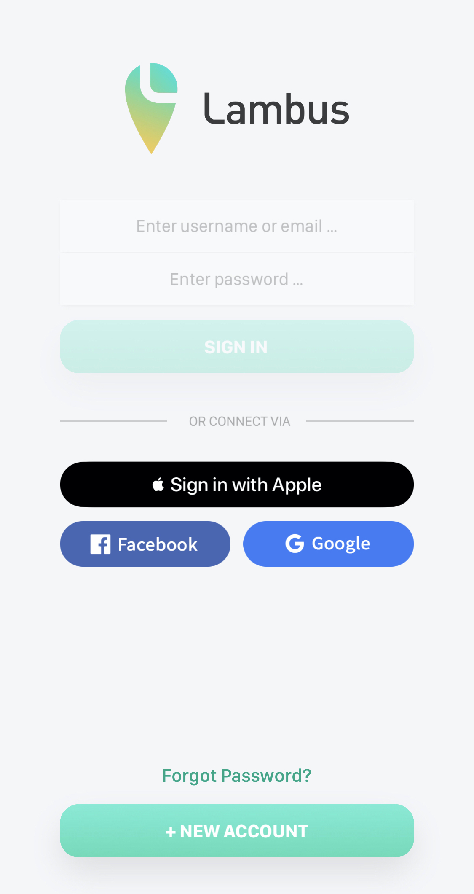
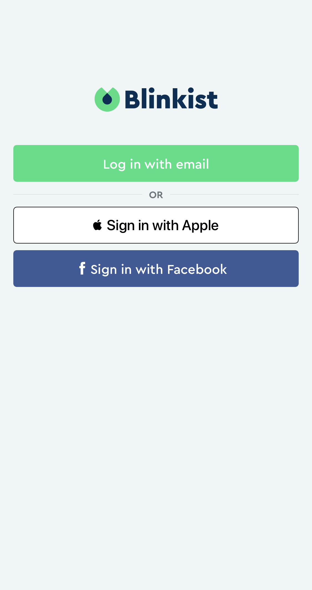
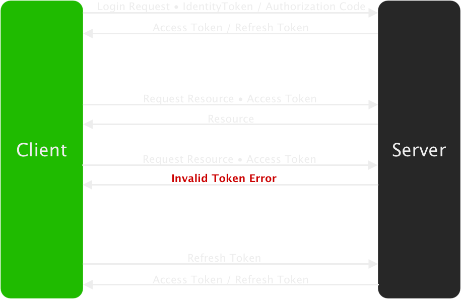

theme: Letters From Sweden, 4
build-lists: false
autoscale: true
footer: Stefan Herold • ioki • 04.12.2019
footer-style: alignment(center)
slidenumbers: true
slidenumber-style: alignment(right)

[.text: alignment(center)]

<br/>
<br/>


## Sicher, schnell und einfach zum neuen Account

---

# About Me

- Stefan Herold • *@blackjacxxx 🐦*
- Mobile Dev seit 2009
- WWDC Session Notes • 2K ⭐️
- Konzern, Agentur und Startup
- Seit 2017 bei *ioki* im Herzen Frankfurts

^ 
- DTAG, N&L und flinc 
- haben sich mit ride sharing befasst
- das hat mich zu ioki geführt

---

# ioki


- Autonomous Driving
- Erster fahrerloser Service Deutschlands
- Bad Birnbach • Bayern
- 2 km • Stadtzentrum - Bahnhof

^
1. Tochtergesellschaft DB
2. 3 Säulen

---

# ioki


- Demand Responsive Transport
- Fahrzeuge nach Bedarf verteilt
- Leuchtturmprojekt mit HVV Hamburg

^
- HVV -> Deutscher Mobilitätspresi 2019

---

# ioki


- Whitelabel
- Passenger App (iOS & Android nativ)
- Driver App (Android Tablets mit React Native)

---

# Sign in with Apple

- schnell, einfach, sicher und privat
- kein Tracking durch Apple
- Registrierung und Login
- App erhält[^1]
  - stabile, eindeutige *userID*
  - *Vor- und Nachname*
  - verifizierte *Email Adresse*

--- 

# Sign in with Apple

| Platform | Apple ID  |
| --- | --- |
| iOS 13+<br />iPadOS 13+<br />tvOS 13+<br />watchOS 6+<br />macOS Catalina 10.15+ | iCloud Nutzer |
| Web<br />Windows<br />Android | beliebige Apple ID |

---

# Sicher

- ~~Passwort~~
- Anti-Fraud
  - On-Device Machine Learning & Account History
  - 1-Bit-Info über Echtheit des Users
  - iOS only
- Zwei-Faktor-Authentisierung 

---

# Privat


Eindeutige, zufällige Email-Adresse
*privaterelay.appleid.com*

- App sieht nur *diese* Adresse
- Kommunikation mit *genau einem* Developer
- Zwei-Wege-Kanal
- Über Einstellungen änder-/deaktivierbar
-  speichert keine Emails

^
- Facebook $ Co leiten original Email weiter
- Rückschlüsse auf Nutzerverhalten erschwert

---

# Wer's braucht[^2]

Apps die exklusiv third-party login service nutzen

- Facebook Login
- Google Sign-In
- Sign in with Twitter
- Sign In with Linked-In
- Login with Amazon
- WeChat Login

---

# Wer nicht

[.build-lists: true]

- App nutzt firmeneigenes Login-System
- App nutzt Ausweisbasiertes Login-System
- App ist Client für 3rd party / social service
- Bildungs-, Enterprise- oder Business-App mit existierendem Firmen-Account

^
- Email / Password
- Ausweis, Reisepass, E-ID
- Facebook oder Twitter Client
- Mitarbeiterportal von Konzernen

---

# Apps


| App          | Email  | Name  |
| ------------ | :----: | :---: |
| Bird         | ✅     | ✅   | 
| Lambus       | ✅     | ✅   | 
| Bring        | ✅     | ✅   | 
| Blinkist     | ✅     | ❌   | 
| Parcel       | ❌     | ❌   | 

^
- E-Scooter Verleih
- Travel Planner
- Einkaufslistenapp mit Kundenkarten Wallet
- Kurze Zusammenfassungen beliebter Sachbücher
- Tracken von Versandstati

--- 

# Apps

     

---

# Registrierung

```swift
func didPressSignInWithApple(_ sender: UIButton) {

  let provider = ASAuthorizationAppleIDProvider()
  let request = provider.createRequest()
  request.requestedScopes = [.email, .fullName] // optional - only request what's required

  let controller = ASAuthorizationController(authorizationRequests: [request])
  controller.delegate = self
  controller.presentationContextProvider = self
  controller.performRequests()
}
```

---

# Registrierung

[.build-lists: true]

Authorization Request returns:

- *UserID* • eindeutig, stabil über alle Geräte mit gleicher AppleID
- *Identity Token* • Nutzerverifizierung 
- *Auth Code* • Refresh Token
- *Real User Indicator* - Boolean: User / Unknown
- *Credential State* - authorized, revoked, notFound
- *Vor- und Zuname* als PersonNameComponents
- *Verifizierte Email* - entfällt beim Onboarding

^
- userID: Bleibt unverändert • selbst nach Trennung von App & AppleID (Settings)
- userID: Authorisierungs-Status, Accouint Recovery, Account Lockout, Customer Support

---

# Registrierung


- Name editierbar
- Nutzer entscheidet über verwendete Email
- Fake Email per Relays
- ~~Lästige Formulare~~
- ~~Keyboard~~
- ~~Verifizierung~~
- ~~2FA~~

---

# Login

Beim Appstart:

```swift
let provider = ASAuthorizationAppleIDProvider()

// Very fast API to be called on app launch to handle log-in state appropriately.
provider.getCredentialState(forUserID: userId) { (state, error) in
  // evaluate state
}
```

State-Änderungen:

```swift
let name = ASAuthorizationAppleIDProvider.credentialRevokedNotification
center.addObserver(forName: name, object: nil, queue: nil) { [weak self] _ in
  self?.performSignOut()
}
```

---

# Demo 👨‍💻

- Vorbereitung von Xcode
- *Sign in with Apple* Button hinzufügen
- Registrierung neuer Nutzer
- Login registrierter Nutzer
- Statuscheck beim Appstart
- Logout Handling bei laufender App
- Tokeninvalidierung durch Nutzer über iOS Settings

^
1. SIWA Capability ➡️ Xcode
2. Xcode erzeugt App ID mit SIWA Capability ➡️ Dev Portal
3. CODE DEMO
4. Revoke

---

# Backend Good To Know

- Identity Token zur Verifizierung der *userID*
- Private Key zum Entschlüsseln des Tokens
- Token nur bei Registrierung - 10 min gültig
- OAuth Flow (Access-/Refresh-Token) notwendig[^3]

---

# Backend - OAuth



---

# Zusammenfassung

- Überblick über Vorteile
- Was bedeuten Sicher & Privat
- *Theorie:* Registrierung & Login
- *Praxis:* Erweitern einer bestehenden App
  - Einrichten von Developer Portal & Xcode
  - Registrierung, Login, Statusänderungen
- Exkurs Backend: *Fallstricke*

---

# Vielen Dank Für's Zuhören 🎉

👩‍💻 Apple Docs
*https://developer.apple.com/sign-in-with-apple*
👨‍⚖️ Review Guidelines
*https://developer.apple.com/app-store/review/guidelines/#sign-in-with-apple*
👨‍💻 REST API
*https://developer.apple.com/documentation/signinwithapplerestapi*
🧐 Demo App Code
*https://github.com/Blackjacx/SignInWithApple*
📺 Introducing Sign In with Apple - Session Video Notes
*https://github.com/Blackjacx/WWDC#introducing-sign-in-with-apple*
🔑 Token Handling im Backend
*https://blog.curtisherbert.com/so-theyve-signed-in-with-apple-now-what*

🐦 Twitter
*@blackjacxxx*

---

# Backup - Mehr Links

- Answers to your bruning questions
*https://techcrunch.com/2019/06/07/answers-to-your-burning-questions-about-how-sign-in-with-apple-works*
- Ray Wenderlich Tutorial mit SwiftUI
*https://www.raywenderlich.com/4875322-sign-in-with-apple-using-swiftui*
- Erzeugen des Private Keys
*https://developer.apple.com/account/resources/authkeys/add*
- Konfiguration erlaubter Email-Adressen
*https://developer.apple.com/account/resources/services/configure*
- Sign in with Apple für Web
*https://developer.okta.com/blog/2019/06/04/what-the-heck-is-sign-in-with-apple*
- 9To5Mac Artikel
*https://9to5mac.com/2019/10/15/how-to-use-sign-in-with-apple-iphone-ipad-mac*

---

# Backup - Todo

- OAuth Diagramm in Sketch
- create backup videos demoing all steps from Demo section

- use ioki iPhone 7 Plus phone number as trusted number
- send the PDF presentation including the github url to ane@ix.de (due 27.11.)

[^1]: Facebook & Co leiten weit mehr Informationen weiter

[^2]: https://developer.apple.com/app-store/review/guidelines/#sign-in-with-apple

[^3]: https://blog.curtisherbert.com/so-theyve-signed-in-with-apple-now-what